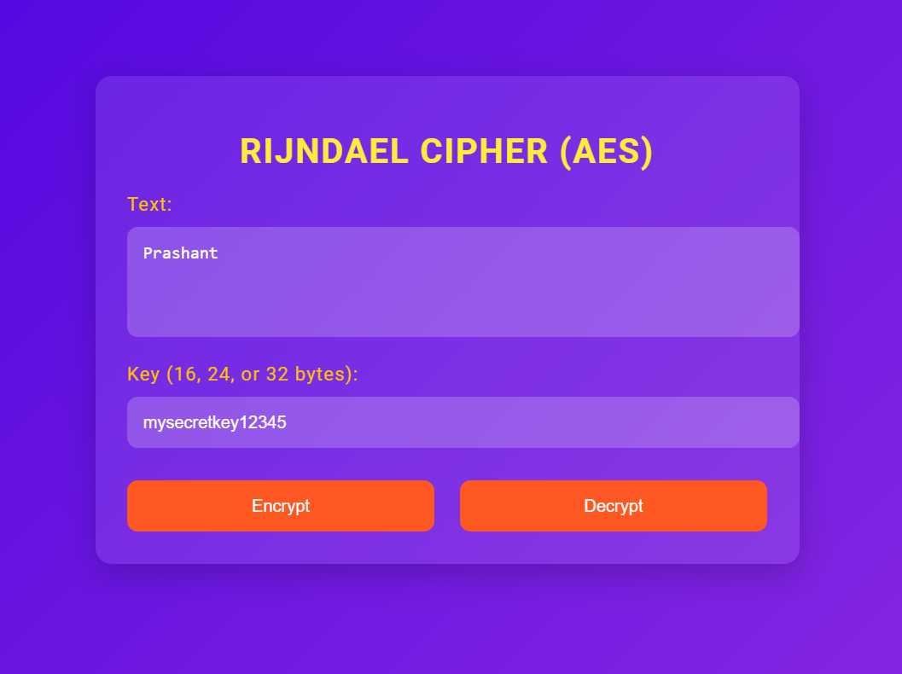

# Rijndael Cipher (AES) Flask App

This is a web application built using Flask, designed to encrypt and decrypt text using the Rijndael (AES) cipher. The app features a dynamic, responsive UI with modern design elements and smooth animations.



## Table of Contents

- [Features](#features)
- [Installation](#installation)
- [Usage](#usage)
- [Project Structure](#project-structure)
- [Contributing](#contributing)
- [License](#license)

## Features

- **Encrypt/Decrypt**: Encrypt plaintext and decrypt ciphertext using the Rijndael (AES) cipher.
- **Responsive UI**: Modern, responsive design with vibrant colors and smooth transitions.
- **Client-side Validation**: Dynamic validation of input fields, ensuring the correct key length.
- **User Feedback**: Real-time feedback on encryption/decryption success or failure.
- **Interactive Experience**: Buttons and inputs provide visual feedback and interactivity.

## Installation

To set up the app locally, follow these steps:

### 1. Clone the Repository

```bash
git clone https://github.com/prashant-sagar-shakya/Rijndael-Cipher.git
cd Rijndael-Cipher
```

### 2. Create a Virtual Environment

Create a virtual environment to manage dependencies:

```bash
python -m venv venv
source venv/bin/activate  # On Windows use `venv\Scripts\activate`
```

### 3. Install Dependencies

Install the required Python packages:

```bash
pip install -r requirements.txt
```

If a `requirements.txt` is not provided, manually install the dependencies:

```bash
pip install Flask pycryptodome
```

### 4. Run the App

Start the Flask development server:

```bash
python app.py
```

The app will be accessible at `http://127.0.0.1:5000/`.

## Usage

### 1. Open the Web App

After starting the server, open your browser and navigate to `http://127.0.0.1:5000/`.

### 2. Encrypting Text

- **Enter Text**: Input the text you want to encrypt.
- **Enter Key**: Provide a key that is 16, 24, or 32 characters long.
- **Click Encrypt**: Press the "Encrypt" button to generate the ciphertext.

### 3. Decrypting Text

- **Enter Ciphertext**: Input the ciphertext you want to decrypt.
- **Enter Key**: Provide the same key used during encryption.
- **Click Decrypt**: Press the "Decrypt" button to reveal the plaintext.

### 4. Output Messages

- The app will display the result of the encryption or decryption in a message box below the form.
- If an error occurs (e.g., invalid key length), an error message will be displayed.

## Project Structure

```
Rijndael-Cipher/
│
├── app.py                   # Main Flask application
├── templates/
│   └── index.html           # HTML template for the web app
└── static/
    ├── css/
    │   └── styles.css       # Custom CSS styles
    └── js/
        └── script.js        # Custom JavaScript for interactivity
```

## Contributing

Contributions are welcome! If you find any bugs or have suggestions for improvements, feel free to open an issue or submit a pull request.

### To Do:

- Add unit tests for encryption and decryption functions.
- Implement additional ciphers or encryption modes.

## License

This project is licensed under the MIT License. See the `LICENSE` file for more details.

---

**Created with ❤️ by [Prashant Sagar Shakya](https://github.com/prashant-sagar-shakya)**